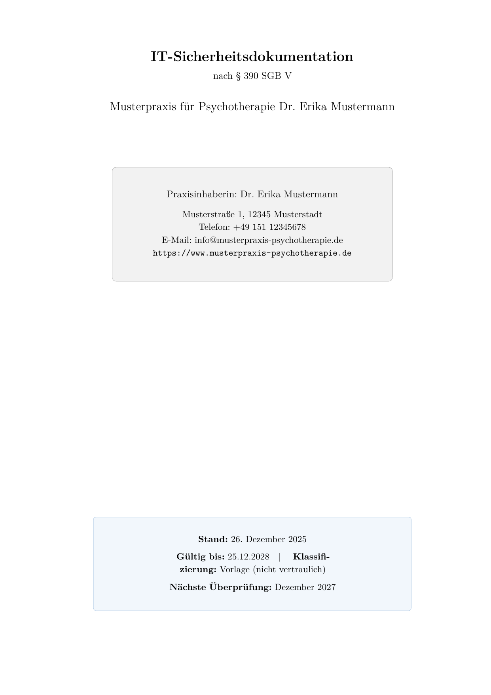
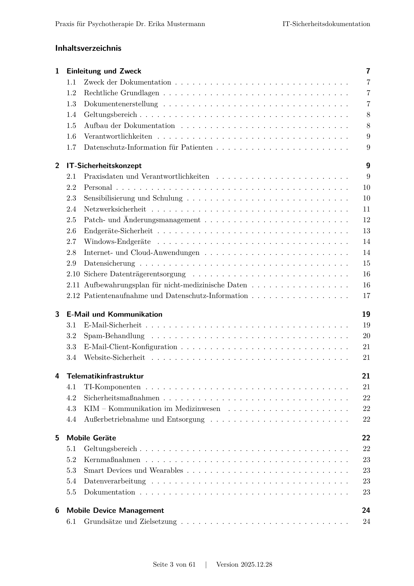
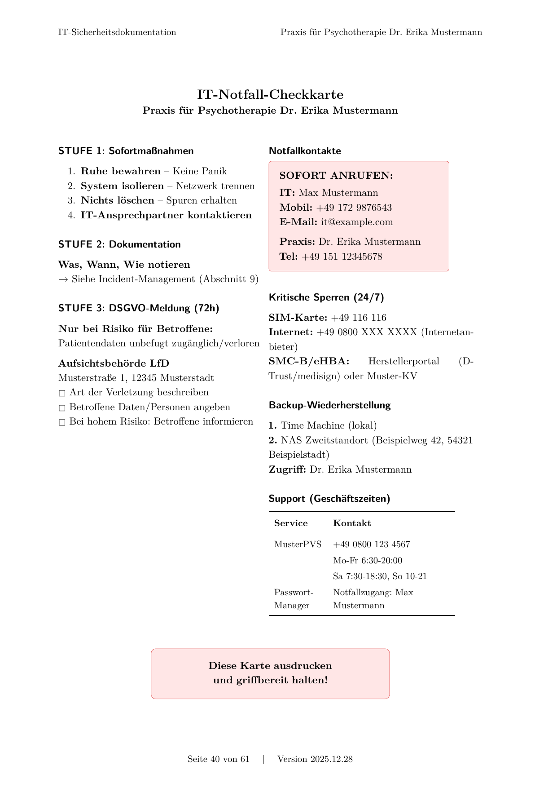

# IT-Sicherheitsdokumentation nach § 390 SGB V

> **Unabhängiges Community-Projekt. Nicht verbunden mit oder autorisiert durch KBV/KVen.**  


**KBV-IT-Sicherheitsrichtlinie umsetzen?**  
Diese Vorlage liefert eine **praxisnahe, auditfähige IT-Sicherheitsdokumentation** inklusive Vorlagen/Anhängen. Als Startpunkt, den Sie **anpassen**, **erweitern** oder **verschlanken** können.

**📄 Beispiel-PDFs herunterladen:**

- [Standard-Version](https://github.com/carhensi/kbv-it-sicherheit-template/releases/latest/download/IT-Sicherheitsdokumentation_v2025.09.01.pdf)
- [Barrierefreie Version](https://github.com/carhensi/kbv-it-sicherheit-template/releases/latest/download/IT-Sicherheitsdokumentation_v2025.09.01-accessible.pdf)

[](https://creativecommons.org/licenses/by-sa/4.0/)
[](https://github.com/carhensi/kbv-it-sicherheit-template/releases/latest)
[](https://github.com/carhensi/kbv-it-sicherheit-template/actions/workflows/build.yml)
[](#archivierbarkeit)
[](#barrierefreiheit)

<table>
<tr>
<td width="33%">
  <a href="docs/screenshots/deckblatt.png">
    
  </a>
  <p align="center"><em>Deckblatt</em></p>
</td>
<td width="33%">
  <a href="docs/screenshots/inhaltsverzeichnis.png">
    
  </a>
  <p align="center"><em>Inhaltsverzeichnis</em></p>
</td>
<td width="33%">
  <a href="docs/screenshots/notfallkarte.png">
    
  </a>
  <p align="center"><em>IT-Notfallkarte</em></p>
</td>
</tr>
</table>

## Was Sie bekommen

- **Praxisnahe Mustervorlage** nach KBV-Richtlinie (Anlage 1, 2, 5)
- **IT-Notfallkarte** zum Ausdrucken
- **Vorlagen** für Geräteliste, Netzplan, Schulungsplan
- **DSGVO-Verarbeitungsverzeichnis**
- **Professionelles PDF** (archivierbar, barrierefrei)

## 💻 Für IT-Dienstleister und technisch Versierte

Die Vorlage nutzt LaTeX für professionelle Dokumentenerstellung. Das bedeutet:

- **Praxisinhaber:** Sie können ihre eigene Praxis gegen das Musterdokument prüfen und den ersten Schritt zu einer Dokumentation machen
- **IT-Dienstleister:** Sie ändern 3 Dateien (Praxisdaten, Geräteliste, Netzplan) und der Build läuft automatisiert per Docker/Make. Alles Weitere kann frei in den LaTeX-Dateien angepasst werden.


## Was Sie anpassen müssen

Die Vorlage enthält Beispieldaten einer fiktiven Praxis. Für Ihre Praxis müssen Sie anpassen:

1. **Stammdaten:** Praxisname, Adresse, Kontakte, Bundesland
2. **Geräte:** Alle IT-Geräte mit Seriennummern erfassen
3. **Netzwerk:** Ihren Netzplan erstellen oder anpassen
4. **Prozesse prüfen:** Stimmen die beschriebenen Abläufe für Ihre Praxis?

> ⚠️ **Hinweis:** Die Vorlage ist ein Startpunkt, kein Fertigprodukt. Planen Sie Zeit ein, die Inhalte sorgfältig auf Ihre Situation anzupassen.


## 📋 Inhalt der Dokumentation

### Kapitel
- **Einleitung:** Zweck, Geltungsbereich, Struktur
- **IT-Sicherheitskonzept:** Personal, Netzwerk, Sicherheit
- **Kommunikationsrichtlinie:** E-Mail, Spam
- **Telematikinfrastruktur:** TI-Betrieb, Sicherheitsmaßnahmen
- **Mobile Geräte:** iPhone/iPad, App-Sicherheit
- **Wechseldatenträger:** USB-Sticks, externe Festplatten
- **Externe Verschwiegenheit:** AVV, Vertraulichkeit
- **Notfall & Incident:** Backup, Wiederherstellung
- **DSGVO-TOMs:** Technische und organisatorische Maßnahmen

### Anhänge & Vorlagen
- 🗺️ **Netzplan** (Mermaid)
- 📊 **Geräteliste** (CSV)
- 📋 **Selbstverpflichtungen** für Mitarbeitende
- 🚨 **IT-Notfallkarte**
- ✅ **KBV-Compliance-Mapping**
- 📝 **Verarbeitungsverzeichnis** (VVT)
- 📚 **Schulungsplan**
- 🔄 **Changelog**


## 🚀 Selbst anpassen

<details>
<summary><strong>Anleitung aufklappen</strong></summary>

### Schnellstart
```bash
git clone https://github.com/carhensi/kbv-it-sicherheit-template.git meine-praxis-doc
cd meine-praxis-doc

# Sample-Dateien als Vorlage kopieren
cp tex/config/metadata-sample.tex tex/config/metadata.tex
cp tex/assets/geraeteliste-sample.csv tex/assets/geraeteliste.csv
cp tex/assets/netzplan-sample.mmd tex/assets/netzplan.mmd

# Anpassen und bauen
make all
# → PDF unter tex/main-standard.pdf
```

### Voraussetzungen
- [Docker Desktop](https://www.docker.com/products/docker-desktop) (empfohlen)
- oder lokale LaTeX-Installation
- Make

### Was anpassen?
1. **`tex/config/metadata.tex`** – Praxisdaten, Bundesland, Kontakte
2. **`tex/assets/geraeteliste.csv`** – Ihre Geräte
3. **`tex/assets/netzplan.mmd`** – Ihr Netzwerk (optional)

### 🔒 Sehr wichtig: Keine echten Praxisdaten ins öffentliche Repo committen

Bitte niemals echte Praxisdaten, Seriennummern, Netzdetails oder personenbezogene Inhalte in dieses öffentliche Repository pushen.

### Eigenes Repository (empfohlen)

Für Versionierung Ihrer Praxisdaten:

```bash
# Eigenes privates Repo erstellen (GitHub/GitLab)
# Dann:
git remote set-url origin git@github.com:IHRE-ORG/IHRE-PRAXIS-doc.git
git add -f tex/config/metadata.tex tex/assets/geraeteliste.csv tex/assets/netzplan.mmd
git commit -m "Add practice-specific data"
git push

# Template-Updates holen:
git remote add upstream https://github.com/carhensi/kbv-it-sicherheit-template.git
git fetch upstream
git merge upstream/main
```

</details>


## 🛠️ Für Entwickler und IT-Dienstleister

<details>
<summary><strong>Technische Details aufklappen</strong></summary>

[](https://github.com/carhensi/kbv-it-sicherheit-template/actions)
[](https://www.latex-project.org/)
[](https://www.docker.com/)

### Build-Kommandos
```bash
make all          # Vollständiger Build
make build        # Schneller Build (nur bei Änderungen)
make version      # Version aktualisieren
make mermaid      # Netzplan generieren
make use-sample   # Sample-Daten für CI
make use-real     # Echte Daten (lokal)
```

### Projektstruktur
```
tex/
├── main.tex          # Master-Dokument
├── config/           # Metadaten, Packages
├── content/          # Alle Kapitel
├── style/            # LaTeX-Styling
└── assets/           # Grafiken, CSV, Mermaid
scripts/              # Build-Skripte
.github/workflows/    # CI/CD Pipeline
```

### Features
- Modularer Aufbau (jedes Kapitel separat)
- CSV-Integration für Geräteliste
- Automatische Versionierung
- PDF/A-3u + PDF/UA-1 Compliance (100%)
- GitHub Actions CI/CD

</details>


## 📋 KBV-Abdeckung

| Anlage | Zielgruppe | Abdeckung | Hinweis |
|--------|------------|-----------|---------|
| **Anlage 1** | Alle Praxen (≤5 Personen) | 41/41 (100%) | 9 Windows-Anforderungen n.a. für macOS |
| **Anlage 2** | Mittlere Praxen (6–20 Personen) | 8/10 (80%) | Kerberos n.a., SIEM überdimensioniert |
| **Anlage 3** | Große Praxen (>20 Personen) | – | Nicht Zielgruppe dieser Vorlage |
| **Anlage 4** | Medizinische Großgeräte | – | CT, MRT, PET – nicht abgedeckt |
| **Anlage 5** | Telematikinfrastruktur | 9/9 (100%) | TI-Gateway, eHBA, SMC-B |


## 📋 PDF-Compliance

### Archivierbarkeit
Das PDF erfüllt **PDF/A-3u** (ISO 19005-3) für Langzeitarchivierung:
- Eingebettete Fonts
- Keine externen Abhängigkeiten
- Maschinenlesbare Metadaten

### Barrierefreiheit
Das PDF erfüllt **PDF/UA-1** (ISO 14289-1) und **WCAG 2.1** für Barrierefreiheit:
- Vollständige Dokumentstruktur (Tagged PDF)
- Screenreader-kompatibel
- Lesereihenfolge definiert

Beide Standards werden im CI/CD automatisch validiert – der Build schlägt bei Abweichungen fehl.


## 🔮 Geplant

- **Praxis-Light Version**: Vereinfachte Dokumentation für Einzelpraxen (~15 Seiten statt 40+)
  - Fokus auf KBV-Mindestanforderungen
  - Weniger Arbeitsvorlagen
  - Einfachere Sprache und Struktur
- **TI-Störungsmanagement**: Checklisten und Prozesse für TI-Ausfälle
- **ePA-Integration**: Dokumentation zur elektronischen Patientenakte
- Service-Module für E-Mail-Anbieter, PVS, Betriebssysteme
- SIEM-Integration (für größere Praxen)
- VLAN-Segmentierung
- IDS/IPS-Konfiguration


## ⚠️ Haftungsausschluss

Diese Vorlage entstand im Dezember 2025 für eine psychotherapeutische Praxis und basiert auf der
KBV IT-Sicherheitsrichtlinie gemäß § 390 SGB V.

**Keine Wartungsgarantie:** Es besteht kein Anspruch auf regelmäßige Updates bei Gesetzesänderungen
oder neuen Sicherheitsanforderungen.

**Eigenverantwortung:** Die Nutzung erfolgt auf eigenes Risiko. Ärztinnen und Ärzte,
Psychotherapeutinnen und Psychotherapeuten sowie alle Praxisinhaberinnen und Praxisinhaber sind
selbst dafür verantwortlich, die Inhalte auf Korrektheit und Anwendbarkeit für die eigene
Praxis-Infrastruktur zu prüfen.

**Keine Rechts- oder IT-Beratung:** Diese Vorlage ersetzt weder eine anwaltliche Beratung noch
die Prüfung durch zertifizierte IT-Sicherheitsbeauftragte.

**Abgeleitete Werke:** Für Forks, Anpassungen oder daraus entstandene Dokumente wird keine
Haftung übernommen.

## 🤝 Mitmachen

Feedback, Verbesserungen und Korrekturen sind willkommen!

- [💬 Diskussion](https://github.com/carhensi/kbv-it-sicherheit-template/discussions)
- [🐛 Issues](https://github.com/carhensi/kbv-it-sicherheit-template/issues)
- [📧 Kontakt @carhensi](https://github.com/carhensi)

[📦 Releases & Changelog](https://github.com/carhensi/kbv-it-sicherheit-template/releases)


